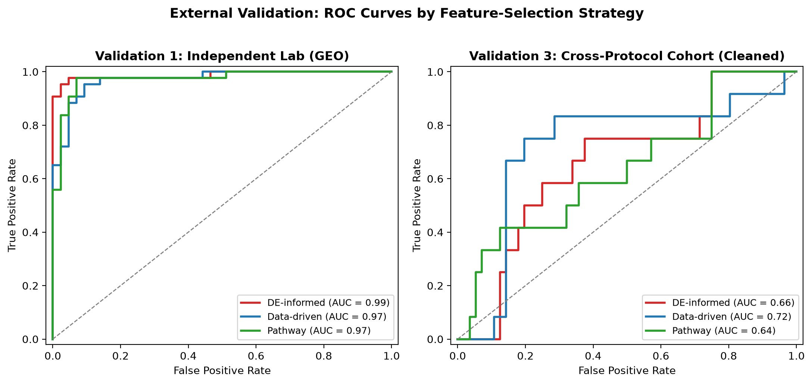
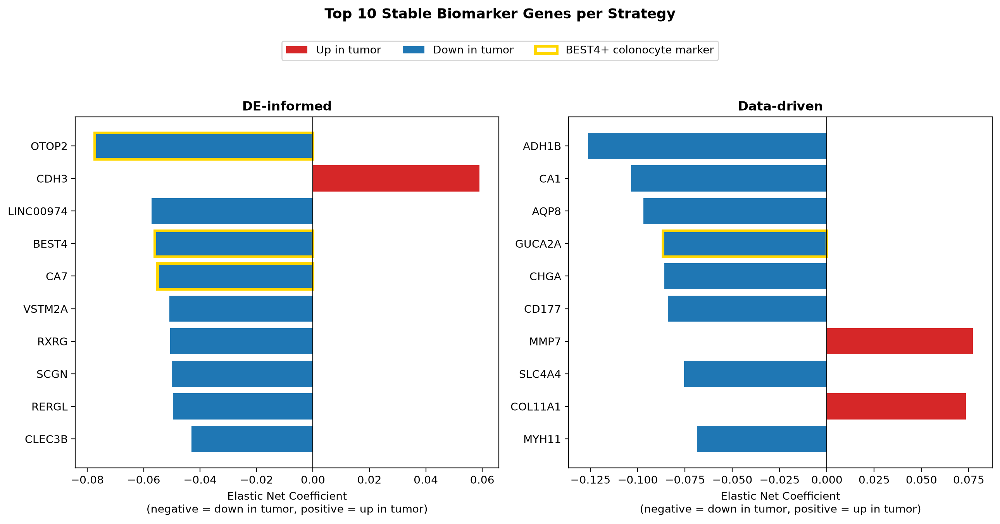
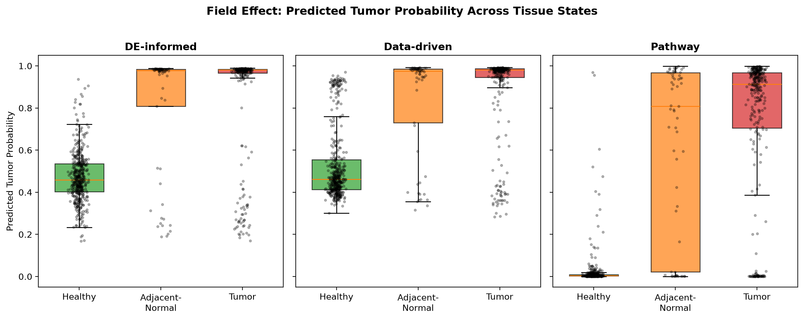

# Cross-Cohort Transcriptomic Machine Learning in Colorectal Cancer

Telling a colorectal tumor apart from normal tissue using gene expression is not a hard problem. Dozens of published models clear 95% accuracy on their own test set. The question this project actually asks is harder: when a model finds genes that separate tumor from normal, do those genes mean something biological, or did the model just learn to recognize which lab processed the sample?

Three feature selection strategies are trained on one large discovery cohort, then tested, completely blind, against four independent validation cohorts collected by different labs, on different sequencing platforms, using different definitions of "normal" tissue. Only one thing is allowed to determine which strategy wins: whether its genes still hold up somewhere else.

## What the pipeline found

**Feature selection strategy determines whether a signal survives contact with new data.** On TCGA-COAD, the discovery cohort, every strategy looks equally good. Tested against an independent lab's matched-pair cohort, an unsupervised, purely variance-based selection strategy reaches an AUC of 0.72, against 0.66 for a standard differential-expression approach and 0.64 for pathway-level selection, the same ranking holding consistently across elastic net, random forest, and XGBoost. Choosing a feature selection method is not a minor implementation detail. It is the difference between finding biology and finding an artifact of your training set.



**Two independent statistical methods converged on the same rare cell type.** Bootstrap stability analysis (200 resamples, patient-level, pre-registered thresholds) identified 149 stable genes from the differential-expression strategy and 182 from the data-driven strategy, with only 4 genes in common between them. Yet four of the strongest individual genes across both strategies, OTOP2, BEST4, and CA7 from one method, GUCA2A from the other, are all markers of the same recently characterized cell population: BEST4+ colonocytes, a rare chemosensory cell type making up under 5% of the healthy colon lining. Two statistically unrelated selection processes landed on pieces of the same underlying biology.



**A frozen model, applied to tissue it never trained on, recovers a known clinical phenomenon.** Scoring healthy colon tissue, tumor-adjacent tissue, and tumor tissue with the same classifier produces a clean, monotonic gradient in every one of nine model variants: healthy tissue scores lowest, adjacent tissue sits in between, tumor scores highest. This lines up with field cancerization, the idea that tissue near a tumor is already partway toward becoming one, without the model ever being told to look for it.



## How it's built

- **Discovery cohort:** TCGA-COAD, 522 samples, tumor vs. tumor-adjacent normal tissue, repeated 5x5 stratified nested cross-validation with patient-level grouping throughout.
- **Three feature selection strategies**, compared head to head under identical conditions: differential-expression-informed, purely data-driven (unsupervised variance ranking), and pathway-level (MSigDB Hallmark gene sets).
- **Four independent validation cohorts**, each frozen and touched exactly once: an independent lab's matched tumor/normal pairs, a set of small multi-institution clinical sites, a cross-protocol single-end sequencing cohort, and a second FieldEffectCrc cohort, each chosen to differ from the discovery cohort in a specific, deliberate way.
- **Biological interpretation grounded in real literature.** Every top gene's role was checked against published sources rather than assumed, and gene-level direction was confirmed two independent ways (model coefficient and measured fold change) before being reported.
- One methodological audit along the way is worth naming directly rather than glossing over: a cross-cohort patient overlap was found and corrected mid-analysis, and the correction is documented in full in the design specification below. Catching it is part of what makes the final results trustworthy.

The complete methodology, every locked decision, and the full reasoning behind each design choice live in [`docs/P2.2_Project_Design_Specification.md`](docs/P2.2_Project_Design_Specification.md), the single source of truth for this project's scope.

## Repository structure

scripts/ R scripts for data acquisition (Bioconductor, TCGA, GEO)
src/data/ Cohort extraction, gene overlap checks, patient-overlap audits
src/preprocessing/ Leakage-safe preprocessing, cross-validation splitting
src/feature_selection/ The three feature selection strategies, as scikit-learn transformers
src/models/ Model configs and the final frozen-model pipeline
src/validation/ Nested CV harness and external validation runner
src/analysis/ Stability analysis, enrichment, biomarker and field-effect scripts
src/figures/ Scripts that regenerate every figure in this README from the result tables
results/ All output tables, figures, and the nine frozen model files
docs/ Full project design specification and decision log


## Running it

Two environments are needed: R for data acquisition (Bioconductor packages, TCGAbiolinks, GEOquery), Python for everything downstream.

```bash
# R environment
conda env create -f environment-r.yml
conda activate p2.2-crc-r
Rscript scripts/00_setup_r_env.R

# Python environment
pip install -r requirements.txt
```

From there, the pipeline runs in order: data acquisition (`scripts/`), cohort extraction and validation-set preparation (`src/data/`), the nested cross-validation experiment (`src/validation/run_nested_cv.py`), model freezing (`src/models/freeze_models.py`), external validation (`src/validation/run_phase4_external_validation.py`), and the stability, enrichment, and interpretation analyses (`src/analysis/`). Each script's docstring documents its exact inputs and outputs. Figures regenerate directly from the committed result tables via `src/figures/`.

## License

See [`LICENSE`](LICENSE).
